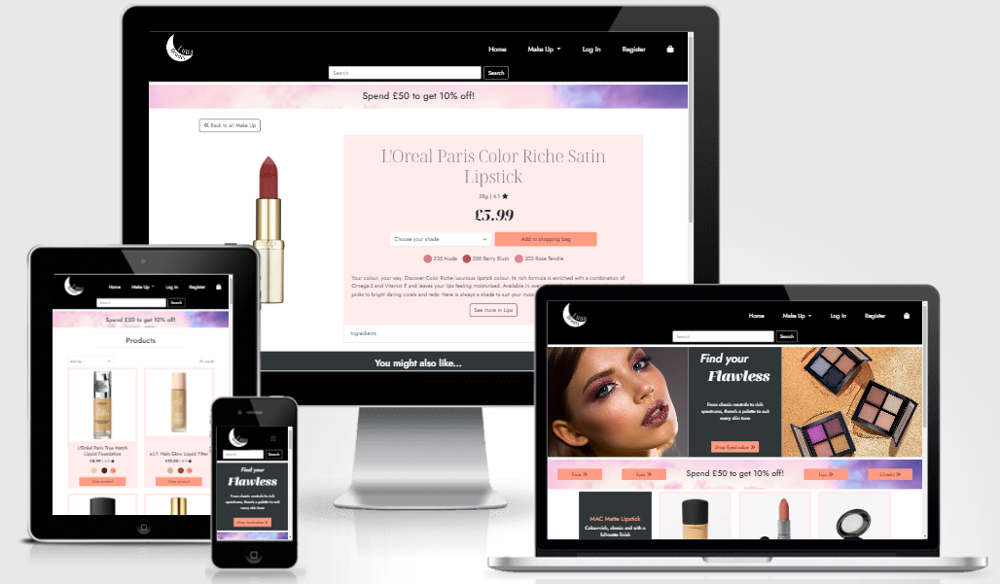

# Luna Beauty
*A makeup ecommerce website where users can browse, filter and sort products. Features a working Checkout app and the ability to create and update a user profile.*



## Purpose and Value

### User Stories
> A young person is looking for a glittery eye shadow for a party they're going to.

> A person in their mid-fifties want a new foundation that suits their skin tone well. 

### User Goals
Users want to be able to browse the website for different make up. They want to be able to filter by type, rather than scrolling through every item on the website.

They'd also like shipping costs added to their total, and any discounts automatically adjusted in their shopping bag.

### Website Goals
To provide users with an easy to use website for browsing make up. To have an attractive home page that showcases a range of products.

### Competitor Reviews

#### Beauty Bay
Pros
> The home page grabs the users attention with large bold images. The Navigation bar is well set out underneath a search bar, that has icons to log in, see your wishlist, and your bag.

Cons
> Once users click the Nav bar items, a huge dropdown appears with a lot of options, which makes it more difficult to navigate to exactly what you need as the content is overwhelming.

#### Boots
Pros
> Once looking through products, the page is clean and easy to read. Users can add a product straight to their basket. Products that come in a range of colours take you to the product page to select the colour you like before adding to basket.

Cons
> The navigation has a lot of different product types, so users looking for Mascara for example, need to search through three Navigation selections, and then filter for Mascara. On the product page, the information isn't collapsible so there's a lot of information constantly on display.

## Objectives

| Objective           | Importance | Viability / Feasibility | To be added |
|------------|------------|-------------------------|--------|
| Users can browse several products using card to display images and brief information |  4  |   5   |  :heavy_check_mark:  |
| Users can choose a colour of a product and add it to their basket  |   5    |   5   | :heavy_check_mark: |
| Users can leave and read reviews for products   |  3  |  2   |    |
| Users are able to save their name and address to their account when checking out |  3  |  4  | :heavy_check_mark: |
| Users can see their order on their profile or in their confirmation email |   4   |   4  | :heavy_check_mark:     |

##### Future features
* Add the option to review items
* Expand the range to include skincare
* Add blog pages about recommendations for products
* Add the option to log in using Facebook or Google
* Add a Wishlist option to the profile
* Make the shades look smarter by only showing the name of the shade in the options menu when the user hovers or clicks on the coloured div

## Wireframes
* [Home Page](./static/README/home.PNG)
* [Products Page](./static/README/products.PNG)
* [Product Details Page](./static/README/product-info.PNG)
* [Bag page](./static/README/basket.PNG)
* [Checkout Page](./static/README/payment.PNG)
* [Checkout Success Page](./static/README/order-successful.PNG)
* [Profile Page](./static/README/profile.PNG)
* [Login Page](./static/README/login.PNG)
* [Sign Up Page](./static/README/sign-up.PNG)

## Prototype
* [Prototype Home Page](./static/README/prototype.PNG)

## Features

#### Navbar and Footer

The Navbar has the Luna Beauty logo, and links to the Home and Shopping Bag, and a dropdown for Makeup with filters for Face, Eyes, Cheeks and Lips. The Shopping bag has the grand total price next to it, if there is one. If there is no user logged in, the Navbar has a Log In and Register links. If the user is logged in there's a Profile link, and if they're a superuser, there's a Manage Products link. Underneath, there's a search bar for users to looks for products.

The Footer features the same Face, Eyes, Lips and Cheeks links, along with Home and Shopping Bag. If there is no user logged in, the Navbar has a Log In and Register links. If the user is logged in there's a Profile link, and if they're a superuser, there's a Manage Products link. There are also Social Media links

#### Home Page

The Home Page features a promotional section for eyeshadow, then a offers section with links to the four make up filters. Underneath is a section for MAC make up.

#### Products Page

This page iterates through all the products, or the products of a certain category. There's a Sort By dropdown to sort by price, rating or alphabetically. The number of results is displayed in the top right and there's a back to top link that appears when the user scrolls.

Each product has an image, the name, price and rating. If the product has shades, such as foundation, the first and last shade are shown, and then a third div has the number of additional shades. Underneath, there's a View Product button to take users to the Product Detail page.

If the user logged in is a superuser, they'll also see the "Edit Product" and "Delete Product" links.

#### Product Detail

At the top there's the latest discount promotion, and a link back to all make up.

Underneath is the product image on the left, and other information about the product on the right, including:
* Name
* Volume
* Rating
* Price
* Shade Selector (if applicable)
* Add to shopping bag link
* Each shade, and their corresponding name
* Description of the product
* A button to see other products in this category
* A dropdown with the products ingredients
* If the user logged in is a superuser, they'll also see the "Edit Product" and "Delete Product" links.

The bottom section is for similar products in that category that the user might like. If the user clicks to add a product to the bag, a Toast with the product name, image and price appears in the top right corner.

#### Shopping Bag

This page iterates through each product in the shopping bag and displays the image, name, shade, price and quantity. The quantity can also be updated or the product can be removed.Underneath is a div to tell the user the delivery cost, and how long it takes. Below is a section that tells the user how much they have to spend to qualify for a discount, or how much discount they've got, and finally underneath is the total, and a link to Checkout. If the bag is empty, the page will display a div that says there's nothing in their bag.

#### Checkout

The checkout page has the bag contents in a card to the right, with the total and discount at the bottom. On the left is a form for users to complete the shipping information. If they're not logged in, underneath are links to Create an Account or Sign In. If the user has an account, the form will pre-populate all fields from the database, and the user can choose to overwrite these fields with new information. They can also save their info, which will overwrite their profile address.

At the bottom is a section for Stripe payments, and two buttons, one to got back and edit their bag, the other is to submit and order. Once Submit, a light pink overlay covers the screen and Font Awesome moon icon circles while the page loads.

#### Checkout Success

Once Checkout is complete, the users order number, and a message that a confirmation email has been sent is displayed. Under this is a card with their order summary, and finally under than is another card with their delivery information on. A success Toast in the corner confirms the order was successful, and at the very bottom is a link back to the Products page.

#### Profile

The profile page is similar to the Checkout page, with a form where users can complete their delivery information on the left. On the right is a card that shows their previous orders, with links to view more information about each order. If there are no previous orders, there is a message under the Order History title to say so.

The link on each order line takes the user to the Checkout Success page, with a Toast to inform them they're looking at a previous order. There's also a link back to the user's profile.

#### Allauth

Additionally, there are all of the Django Allauth templates. These have been styled to fit the Luna Beauty website, but still have the same core components that Allauth presents.

## Design

#### Colours
I decided to have a black and while theme in the header and footer to tie in with the logo black and white, referencing the moon and the night sky. I also feel this gives the website a professional and clean look.

I think the dark peach `#FF9C83` for buttons and hover qualities goes well with the black and white, and also goes well with a lot of the product images, such as the lipsticks and blushers. I chose the light peach `#FFECEB` background for the cards as it contrasts nicely with the dark peach. I chose a very dark grey for the bottom section of the Home page to give definition against the black background of the footer.

Each shade in the shades.css file has a HEX taken straight from the websites referenced in [Credits](#credits) section.

#### Typography

I decided to use Jost for most of the website, as it has a clean and modern feel. I used Noto as a decorative font for impact, such as on the eyeshadow promotion, the prices on the product detail page and the product titles.

#### Imagery
I created the Luna Beauty Logo as a moon to fit the luna theme. I chose a face with a creative eyeshadow look to engage users, and the three palettes to show a range of colours. I also decided to use the clouds image behind the discount offer because the pinks and purples tied in to the colour scheme of the website, and the sky theme ties to the luna theme.

On the home page I also added three Font Awesome icons, to reflect the imagery of the writing below each one. I used double arrows on some important buttons, a little delivery van on the bag page, and added the Font Awesome star icon next to the rating.

#### Styling
I wanted the site to look sharp and professional but also engage with the fun side of make up, so I made most of the website with sharp corners but added a small rounding to most buttons. I also liked that the form fields have a little extra rounding. I also added a margin top and bottom in the light peach `#FFECEB` to each page heading.

### Backgrounds
The background for the website is just a standard white to keep a fresh and clean look and not draw from the products. As mentioned above, the product cards have a light peach `#FFECEB` and I chose a cloud background for the discount promotion.

## Responsive Design

#### 4K Screens
At 4K most of the text is has a larger size, including headings and icons. The products are evenly spaced to adjust to the larger screen and all forms have expanded to fill the space set by the Bootstrap columns

#### Large Laptop
The home images on the eyeshadow promotion have adjusted to the screen size and the checkout and product cards fit comfortably in the space. The font is also a little smaller then 4K Screens to suit the size.

#### Laptop
At Laptop size, the checkout success divs change from a `col-4` to `col-6` to fill the space well. The home eyeshadow promotion images are well sized and the Add Product and Edit Product pages have forms at `col-6`.

#### Tablet
Downsizing to tablet changes the eyeshadow promotion to only show the palettes, as the face image changes to `display: none;`. The Eyes and Cheeks links in the discount promotion on the Home page also become `display: none;` and the MAC promotion images change into two rows of two, instead of one row of four.

The products page now has two product per row instead of three, and the product detail page now has the prodcut image stacked on top of the description card. The profile page has also changed to a column instead of a row and the delivery info is now stacked on top of the order history.

On the Profile page, the order history now only shows the order number and date the order was placed to make the most of the space. For smaller tablets and below, the product description div on the Product Details page fills the space from side to side with no margin.

#### Mobile
At Mobile size, the Home page has changed so both images by the eyeshadow promotion are `display: none;` and the links on the discount promotion have also changed to `display: none;`. The MAC promotion is one card per row now. I changed the text inside the div advertising MAC as the this div and the last product are too far away from each other to tie in together properly.

The Best Brands div has also changed to a column, and the footer has two columns with the social media links still in a row. In the navbar, the links are inside a burger menu and the search bar is set to col-8.

Products are now stacked in rows of one and the shades on the product detail page have adjusted to the size of the container. As a [feature for the future](#future-features) I would love to smarten up the shades the name of the shade only shows when the user hovers or clicks. I think this would make the shade divs closer together and they wouldn't vary in length, pushing them in uneven columns.

The Bag page has also changed, with the product images on top of the description, quantity and price, and on the checkout page the order summary is above the shipping details form.

#### Small Mobile
At Smallest Mobile size, the Toasts still fit comfortably in the middle, with a `max-width: 300px` leaving a 10px of margin either side. The logo has downsized to `height: 80px;` and `width: 80px;` with a little less margin either side. Generally across the site most divs now have a col-11 or col-10 to use up the space, but also leave a little margin around.

## Fixed Bugs

#### Delivery Cost
I tried adding my delivery costs to my total costs once the discount had been removed (if necessary) in the bag app. However, I had an error showing that said I couldn’t add a decimal and a float. I researched on Google and found a really interesting website called [Tiny Struggles](https://tinystruggles.com/posts/django_decimals/) which helped me convert my float into a decimal by using:

`from decimal import Decimal`

and then amending my discount using:

`discount = Decimal((total / 100) * settings.DISCOUNT_PERCENTAGE)`

#### Stripe
I initially created my checkout form to have fields for “First Name” and “Last Name”. However, while trying to get my Stripe Webhooks working, I had an error come up to say “Received unknown parameters “first_name”, “last_name”. I realised this was because [Stripe](https://docs.stripe.com/js/elements_object/create_payment_element#payment_element_create-options-business) was expecting one name field to come through, not two. I initially fixed this by using the concatenate function in Javascipt to put the first name and last name fields together. However, I ended up deciding the easier way to fix this issue was to amend the Checkout Model to only have a field for “Name”.

#### Products Model – Shade
I wanted to add the option of users choosing different shades for products such as foundation. When learning how to create the Product model, I saw examples where the developer had a set list of “XS, S, M, L, XL” for all products, but I wanted to be able to have a different array for each product. To fix this issue, I found a field called “ArrayField” in the [Django Documentation](https://docs.djangoproject.com/en/5.0/ref/contrib/postgres/fields/#arrayfield) that can have varying lengths, so that the shades can be iterated through. 


#### Back to Top Button
I created a back to top button, but wanted it to be invisible while the user is at the top of the page. I researched online and found a very helpful answer from Codesayan on [Stack Overflow](https://stackoverflow.com/questions/57229839/is-there-a-way-to-display-none-on-scroll-and-on-click)
I started by adding a function to make the Back to Top button display: none when the page loads. Then, when the user scroll is <= 100, the button staying in display:none. But if the user scroll is > 100, the button is shown.

#### Toasts
I originally tried to add the messages for toasts the way I had been taught, however I believe as I am using the most up-to-date version of Bootstrap, the following wouldn’t work:
```
$('.toast').toast('show');
```
 
I did some research on the [Code Institute Slack Community](https://code-institute-room.slack.com/archives/C026VTHQDNY/p1674258291733649) and found other students had been having the same issue. I was able to put together the following code which fixed my Toast’s not showing:
```
const lbToastList = $('.toast');
    for (let lbToast of lbToastList) {
        const toast = new bootstrap.Toast(lbToast);
        toast.show()
    }
 ```

 #### Shade ID

I was able to insert the shade straight into the ID of a span using Django templating, but the ID's still had spaces and capital letters since this is what is in the database. I started by adding `| lower` to the ID which sorted the case issue. Then I used jQuery to iterate through the spans, using the `.each()` function, found on the [jQuery documentation](https://api.jquery.com/each/). Lastly, I was able to use `.split()` and `.join()` to replace the spaces with hyphens. I found out how to do this from a helpful post on [Stack Overflow](https://stackoverflow.com/questions/1983648/replace-spaces-with-dashes-and-make-all-letters-lower-case).

After this, the shade's ID's were showing correctly - `#003 Moon` was now `#003-moon` - however I then encountered another issue. CSS ID's can't start with a number, so I moved the code I'd written into a variable called `oldShade`. Then, I created a new variable called `newShade` and set it equal to `"lb-" + oldShade` which fixed this issue.

#### Shades Preview

I wanted to add a couple of the shade to the product page, and then a third circle with the number of how many more shades availble there are. I tried to use `forloop.counter` in Django templating - as suggested in a [Stack Overflow](https://stackoverflow.com/questions/8659560/django-template-increment-the-value-of-a-variable) post, but I couldn't see an easy way to set a variable, then use `+=1` while iterating through the shades. Instead, I used `` to show two example shades. I also found a very interesting page on [Pypi](https://pypi.org/project/django-mathfilters/) that explained Django Math Filters. I was able to use Math Filters to subtract 2 from the length of the shades array, to show the user how many more shades Luna Beauty offers in for that product.

#### Footer

Most of my pages fill the page and push the footer to the bottom. However, after creating the Profile App I realised my footer was not sticking to the bottom of the page, regardless of the content height. I added a div with a class of "content" and used the [CSS Tricks](https://css-tricks.com/couple-takes-sticky-footer/) website to make sure my footer would stay at the very bottom of any page.

#### Email Apostrophes

I noticed when a user orders a product with an apostrophe in the name, such as "Lash 'n Roll" or L'Oréal, the confirmation email would have “L&#x27;Oreal" written on it instead. I researched and found a helpful page on [W3 Schools](https://www.w3schools.com/django/ref_tags_autoescape.php) where I found I could put `` and ``, and this would display the apostrophe as it should be.

#### Save Info

My "Save Info" checkbox was working if a user wants to save their info to their account. However, if they unchecked the box, the profile details were still being overwritten. I put print statements before each time "save_info" was used, and found two were showing up as "True" when the checkbox was unchecked. I fixed these by adding `if save_info != "false":` to the handle_payment_intent_succeeded function in webhook_handler.py. However, this didn't fix the issue. I also tried calling the stripe_elements.js file in `` instead of ``, as suggested on [this post](https://app.slack.com/client/T0L30B202/C7HS3U3AP/1605302104.469800) in the Code Institute Slack community, but this didn't fix the issue either.

I spoke to the Tutor Support team for Code Institute and found that the "save_info" session variable wasn't being deleted after the profile had previously been overwritten. I was able to fix this by adding `del request.session['save_info']` to the checkout_success function in views.py in the Checkout app, after the if statement to check whether "save_info" was true or false.

#### Django Testing

After writing my Django tests in the Checkout and Product apps, I was having problems running the tests. I spoke to a member of the Code Institute support team and we figured out that I'm been running my database in PostgreSQL because the ArrayField in my Product app is not supported by SQLite3. I amended the models to:

```
    if 'DEVELOPMENT' in os.environ:
        shades = models.TextField(max_length=200, null=True, blank=True)
    else:
        shades = ArrayField(models.CharField(max_length=200), null=True, blank=True)
```

I also commented out my Database URL in env.py, and deleted my migrations as they referenced the ArrayField. Once this was complete, I was able to migrate the changes in SQLite3. I wrote and ran my tests, which all came up as successful.

Once I was done with testing, I deleted the migration file in the Products app, and uncommented the Database URL in env.py. I tried to migrate again but kept getting another error:

`Migration checkout.0001_initial dependencies reference nonexistent parent node ('products', '0001_initial')`

I searched the internet and struggled for a while with this issues. I tried creating a new workspace from the last commit, to see if I could replicate where the code went wrong. I added my testing documents to this new workspace and commit the changes, with the idea of writing the issue up in my fixed bugs. 

I tried to migrated this new version, but when creating a superuser, an error came up that said:

`django.db.utils.OperationalError: no such column: profiles_userprofile.default_name`

After taking a break, I decided to try fixing the original file once more, as I'd realised I still had migrations that hadn't been deleted. I deleted all migrations and found I was then able to migrate properly, and I could run the SQLite3 database, and pass all the tests. I also found I'd got the development version of the project to work in port 8000.

I tried to commit my changes, but as I had committed from a different workspace, I had to use `git pull original main`. There was a discrepancy between the two test.py files in the Product apps. The change was one had an extra blank line, so I used `git merge` to fix this issue, and was then able to commit my new changes.
 
## Unfixed Bugs

#### Django Testing (continued)

Due to using the ArrayField in models.py in the Proucts app, I am unable to use SQLite3 in Development mode. This means each time I need to access Development mode, if I create a new workspace I would need to add the PostgreSQL Database URL to my env.py.

#### Shades

Each shade in the products app has a corresponding ID. In shades.css I've created an individual background colour hex for each shade, to give users the most accurate colour choice when selecting their shade for foundations or lipsticks. However, currently there is no way for an Admin to add the hex to the shades.css, so this would need to be added the developer. As a future feature, I would like to change this so the Admin can add their shades, and the corresponding HEX colour could be added to shades.css.

## Deployment
I managed to deploy the website without any issues, and all my links worked perfectly. I used the following steps to achieve this:

1. I created an account on Heroku for deploying the site, and ElephantSQL to host my database.
2. I created the database on ElephantSQL using the "Create new instance", giving the project a name and selecting my plan and location.
3. Then I created a requirements.txt file, and a Procfile, both of which are needed to deploy on Heroku.
4. I used the "Create new app" button on Heroku and gave my project a name.
5. I copied the URL from my ElephantSQL project and applied it as a Config Var under the Settings tab on Heroku.
6. I added the rest of the variables from my env.py file to my Config Vars section on Heroku.
7. I changed to the Deploy tab on Heroku, and clicked on Connect to Github.
8. I enabled automatic deploys and deployed from the main branch.
9. I built my database by migrating my models to PostgreSQL, then using `python3 manage.py loaddata` for `categories` and `products`.
10. I created a new superuser, and an AWS Account.
11. I used AWS to host my Media and Static files by using S3, and created Users, Groups and Policies before uploading the files to the relevant folder.
10. I checked my project had successfuly deployed using the "Open App" button on Heroku.

## Credits

#### Technologies
* [Django](https://www.djangoproject.com/)
    * Project Framework

* [Stripe](https://stripe.com/gb)
    * Take payments in the Checkout app

* [SQLite3](https://www.sqlite.org/)
    * Development Database

* [ElephantSQL](https://www.elephantsql.com/)
    * Production Database

* [Heroku](https://heroku.com/)
    * Deployment

* [Figma](https://www.figma.com/)
    * Wireframes
    * Prototype

* [Bootstrap](https://getbootstrap.com/)
    * Grid styling
    * Toast styling
    * Navbar for all sized screens
    * Buttons
    * Checkbox
    * Card Styling

* [Font Awesome](https://fontawesome.com/)
    * Social Media icons
    * Button double arrows
    * Bag icon on navbar
    * Info, Success, Warning and Error toast icons
    * Moon icon overlay

* [Google Fonts](https://fonts.google.com/)
    * Noto
    * Jost

* [Favicon Converter](https://favicon.io/favicon-converter/)
    * Moon Favicon

#### Code
* [Random Number Generator](https://www.random.org/integers/?num=45&min=100000000&max=999999999&col=5&base=10&format=html&rnd=new)
    * Creating Product SKU's

* [Stack Overflow](https://stackoverflow.com/)
    * See [Fixed Bugs](#fixed-bugs) section

#### Media
* [Am I Responsive image](https://amiresponsive.blogspot.com/)
* [Purple clouds behind the discount offer](https://www.pexels.com/photo/purple-sky-1287142/)
* [Three eyeshadow palettes on the home page](https://www.pexels.com/photo/three-black-square-makeup-palettes-2639947/)
* [Photo of a woman with make up on the home page](https://pixabay.com/photos/woman-portrait-face-skin-make-up-3096664/)
* [Logo created by me on Canva](https://www.canva.com/en_gb/)
* [Favicon created by me on Canva](https://www.canva.com/en_gb/)
* Prototype Images
    * [Face with eyeshadow](https://www.pexels.com/photo/close-up-photo-of-woman-with-pink-eyeshadow-3912572/)
    * [Close up of eyeshadow palette](https://pixabay.com/photos/makeup-palette-colorful-eyeshadow-1138857/)
    * [Eyeshadow colours and brushes](https://www.pexels.com/photo/colored-powders-and-brush-1749452/)
    * [Assorted lipgloss colours](https://www.pexels.com/photo/five-assorted-color-of-liquid-lipsticks-3373738/)

#### Product Images, Shades and Descriptions

##### Face
* L'Oréal Paris True Match Liquid Foundation
    * [Boots](https://www.boots.com/loreal-paris-true-match-foundation-30ml-10200787)
    * [Loreal Paris](https://www.loreal-paris.co.uk/true-match/foundation)

* e.l.f. Halo Glow Liquid Filter
    * [Boots](https://www.boots.com/elf-halo-glow-liquid-filter-10318554)
    * [Beauty Bay](https://www.beautybay.com/p/elf-cosmetics/halo-glow-liquid-filter/ )

* NARS Sheer Glow Foundation
    * [Boots](https://www.boots.com/nars-sheer-glow-foundation-10286863)
    * [Nars Cosmetics](https://www.narscosmetics.co.uk/en/sheer-glow-foundation/999NACSGLWF01.html?cgid=Discover&bvstate=pg:53/ct:r)

* Estée Lauder Double Wear Stay-in-Place Foundation
    * [Boots](https://www.boots.com/estee-lauder-double-wear-stay-in-place-makeup-spf-10-30ml-10249140)

* MAC Studio Fix Fluid Spf15 Foundation
    * [Beauty Bay](https://www.beautybay.com/p/mac-cosmetics/studio-fix-fluid-spf15-foundation/nw20/)

* Makeup Revolution Conceal & Define Foundation
    * [Beauty Bay](https://www.beautybay.com/p/makeup-revolution/conceal-and-define-foundation/f2/)

##### Lips
* e.l.f Glow Reviver Lip Oil
    * [Beauty Bay](https://www.beautybay.com/p/elf-cosmetics/glow-reviver-lip-oil/honey-talks/)

* MAC Matte Lipstick
    * [Beauty Bay](https://www.beautybay.com/p/mac-cosmetics/matte-lipstick/marrakesh/)

* L'Oreal Paris Color Riche Satin Lipstick
    * [Boots](https://www.boots.com/loreal-paris-color-riche-satin-lipstick-10248257)
    * [Loreal Paris](https://www.loreal-paris.co.uk/color-riche/satin/lipstick-303-rose-tendre)

* NYX Professional Makeup Butter Lip Gloss
    * [Boots](https://www.boots.com/nyx-professional-makeup-butter-gloss-10207772)
    * [NXY Cosmetics](https://www.nyxcosmetics.co.uk/lips-makeup/lip-gloss/butter-gloss-lip-gloss/NYX_089.html?dwvar_NYX__089_color=Sorbet)

* Maybelline Lifter Gloss Hydrating Lip Gloss
    * [Boots](https://www.boots.com/maybelline-lifter-gloss-plumping-hydrating-lip-gloss-hyaluronic-acid-10292293)
    * [Maybelline](https://www.maybelline.co.uk/all-products/lip-makeup/lip-gloss/lifter-gloss-lip-gloss-makeup-with-hyaluronic-acid?variant=Moon)

* Clinique Pop Plush Creamy Lip Gloss
    * [Beauty Bay](https://www.beautybay.com/p/clinique/pop-plush-creamy-lip-gloss/pink-gimlet/)

##### Eyes

* Maybelline Lash Sensational Sky High Mascara
    * [Beauty Bay](https://www.beautybay.com/p/maybelline/lash-sensational-sky-high-mascara/lash-sensational-sky-high-mascara/)
    * [Maybelline](https://www.maybelline.co.uk/all-products/eye-makeup/mascara/lash-sensational-sky-high-washable-mascara-makeup?variant=Blue+Mist)

* e.l.f. Lash 'n Roll Curling Mascara
    * [Beauty Bay](https://www.beautybay.com/p/elf-cosmetics/lash-n-roll-curling-mascara/)

* Maybelline Lash Sensational Mascara Intense Black
    * [Beauty Bay](https://www.beautybay.com/p/maybelline/lash-sensational-mascara-intense-black/)

* Urban Decay Perversion Mascara
    * [Beauty Bay](https://www.beautybay.com/p/urban-decay/perversion-mascara/)

* Clinique High Impact Mascara
    * [Beauty Bay](https://www.beautybay.com/p/clinique/high-impact-mascara/black/)
    * [Clinique](https://www.clinique.co.uk/product/1606/5416/makeup/mascara/high-impacttm-mascara)

* Revlon ColorStay Day to Night Eyeshadow Quad Pretty
    * [Boots](https://www.boots.com/revlon-colorstay-16-hour-eyeshadow-palette-10137952)
    * [Sainsburys](https://www.sainsburys.co.uk/gol-ui/product/revlon-colorstay-day-to-night-eyeshadow-quad-stunning-48g)

* Max Factor Masterpiece Nude Eyeshadow Palette Rose Nudes
    * [Boots](https://www.boots.com/max-factor-masterpiece-nude-eyeshadow-palette-rose-nudes-10298639)
    * [Superdrug](https://www.superdrug.com/make-up/eye-makeup/eye-shadow/eye-shadow-palettes/max-factor-masterpiece-nude-palette-003-rose-nudes/p/807480)

* Urban Decay Naked 3 Mini Eyeshadow Palette
    * [Boots](https://www.boots.com/urban-decay-naked-3-mini-eyeshadow-palette-10318139)

* No7 Limited Edition Pink Collection Eyeshadow Quad
    * [Boots](https://www.boots.com/no7-limited-edition-pink-collection-eyeshadow-quad-10338258)

* NYX Professional Makeup Ultimate Shadow Palette Vegan 16-Pan Warm Neutrals
    * [Boots](https://www.boots.com/nyx-professional-make-up-ultimate-shadow-palette-vegan-16-pan---warm-neutrals-10334185)

* e.l.f. Bite-Size Eyeshadow Palette I Love You A Latte
    * [Beauty Bay](https://www.beautybay.com/p/elf-cosmetics/bite-size-eyeshadow-palette-i-love-you-a-latte/)

* Max Factor Color Xpert Soft Touch Palette 004 - Veiled Bronze
    * [Boots](https://www.boots.com/max-factor-color-xpert-soft-touch-palette-veiled-bronze-10290538)

##### Cheeks

* Benefit Mini Dandelion Baby-Pink Brightening Blush
    * [Boots](https://www.boots.com/benefit-mini-dandelion-baby-pink-brightening-blush-2-5g-10315037)

* L'Oreal Paris Blush of Paradise Melon Dollar Baby
    * [Boots](https://www.boots.com/loreal-paris-blush-of-paradise-melon-dollar-baby-10295638)

* Clinique Blushing Blush Powder Blush
    * [Boots](https://www.boots.com/clinique-blushing-blush-powder-blush-6g-10047580)

* bareMinerals Gen Nude Blushlighter
    * [Boots](https://www.boots.com/bareminerals-gen-nude-blushlighter-10328161)

* e.l.f. Primer-Infused Bronzer
    * [Beauty Bay](https://www.beautybay.com/p/elf-cosmetics/primer-infused-bronzer/)

* MAC Mineralize Blush Warm Soul
    * [Beauty Bay](https://www.beautybay.com/p/mac-cosmetics/mineralize-blush/warm-soul/)

* NXY Highlight and Contour Pro Palette
    * [Beauty Bay](https://www.beautybay.com/p/nyx-professional-makeup/highlight-and-contour-pro-palette/)

## Acknowledgements
* The fantastic Student Support Team at Code Institute
* My City of Bristol College Tutors