# Tests - Luna Beauty

## Automated Testing

### Validators

#### W3C HTML Validator

Base Template
* All warnings were due to Django Templating not being acceptable HTML.

Navbar
* All warnings were due to Django Templating not being acceptable HTML.

Footer
* All warnings were due to Django Templating not being acceptable HTML.

Home Page
* I had opened the anchor element `` inside and outside an if statement. I fixed this by removing the one outside the if statement to remain consistent with the rest of the website.
* I have an error due to a H3 element being empty, but this is because the element is occupied by a Font Awesome icon.
* I had a stray `</i>` so I have removed this.
* All other warnings were due to Django Templating not being acceptable HTML.

Login Page
* I had a trailing slash on my `input` element, this has now been removed.
* All other warnings were due to Django Templating not being acceptable HTML.

Signup Page
* I had a trailing slash on my `input` element, this has now been removed.
* All other warnings were due to Django Templating not being acceptable HTML.

Profile
* All warnings were due to Django Templating not being acceptable HTML.

Products Page
* `
` cannot be a child of a `span` element - I have changed the `span` to a `div`.
* I also realised I had two `` blocks with seperate JavaScript to I combined these and confirmed they still both work.
* All other warnings were due to Django Templating not being acceptable HTML.

Product Detail
* I had three `<input>` elements with closing tags, these have been deleted.
* I had also added a `href` to an `<input>` element, this has also been deleted.
* All other warnings were due to Django Templating not being acceptable HTML.

Bag Page
* My image was missing an `alt` attribute, I have now added this.
* All other warnings were due to Django Templating not being acceptable HTML.

Checkout Page
* `<h1>` cannot be a child of a `span` element - I have changed the `span` to a `div`.
* All other warnings were due to Django Templating not being acceptable HTML.

Checkout Success Page
* All warnings were due to Django Templating not being acceptable HTML.

Add Product
* All warnings were due to Django Templating not being acceptable HTML.

Edit Product
* All warnings were due to Django Templating not being acceptable HTML.

Success Toast
* My image was missing an `alt` attribute, I have now added this.
* All other warnings were due to Django Templating not being acceptable HTML.

Info Toast
* All warnings were due to Django Templating not being acceptable HTML.

Warning Toast
* All warnings were due to Django Templating not being acceptable HTML.

Error Toast
* All warnings were due to Django Templating not being acceptable HTML.

#### W3C CSS Validator

Base CSS
* I had tried to style the accordion button then changed my mind, but I had left `background-colour: none;`. This has now been deleted.

Checkout CSS

Shades CSS
* I had left accidentally duplicated a shade and put a HEX as the selector. This has now been deleted.

Profile CSS

#### JSHint

Stripe Elements JavaScript File
* Two missing semi-colons. Now corrected, no errors.

Country JavaScript File
* Three missing semicolons, one unnecessary semicolon. Now corrected, no errors.

Bag Page
* No errors

Product Detail Page
* Three missing semi-colons. Now corrected, no errors.

Products Page
* Eleven missing semi-colons. Now corrected, no errors.

Email Page
* No errors.

#### Django Testing

As explained in my [Fixed Bugs](https://github.com/lilli-mcnally/luna-beauty?tab=readme-ov-file#django-testing) section, I did have some issues with getting the tests to work. However, when I was able to run the tests, I got all 19 to pass. Below are links to the two test files:

* [Products](./products/tests.py)
* [Checkout](./checkout/tests.py)

#### Flake8

I used Flake8 to see if there were any PEP8 Compliance errors in my code. I had a range from lines being to long to trailing whitespace. I've used Autopep8 to fix as many linting errors as possible except for:

    * Some files automtically came from Django with imports, which I have not used.
    * Some lines are too long because they're strings.
    * I haven't changed any linting errors found in my migration files.

#### Spell Check

I put my README in a [Microsoft Word](https://www.microsoft.com/en/microsoft-365/word?market=af) document and used the Editor to fix spelling mistakes.

### Lighthouse

#### Add Product Desktop

#### Add Product Mobile
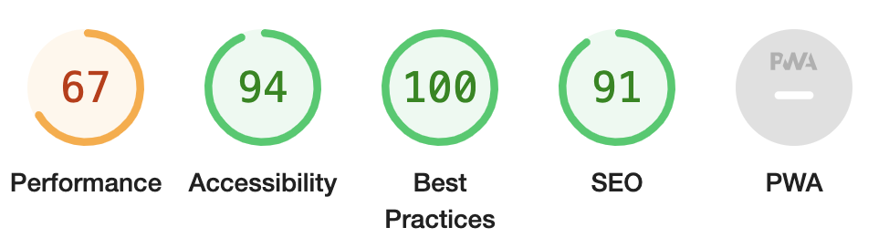

#### Bag Desktop
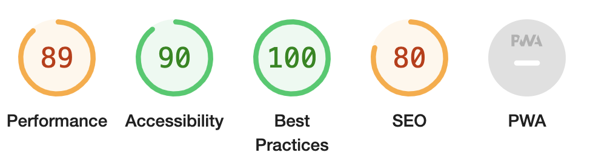

#### Bag Mobile
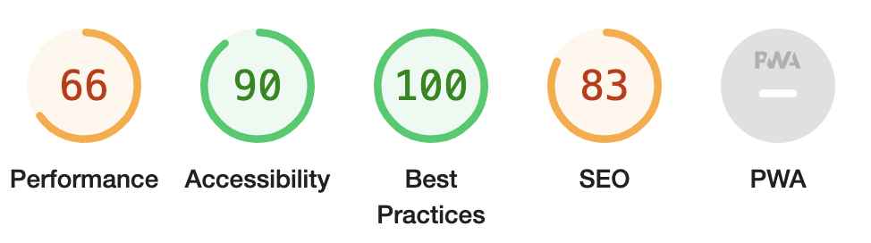

#### Checkout Desktop
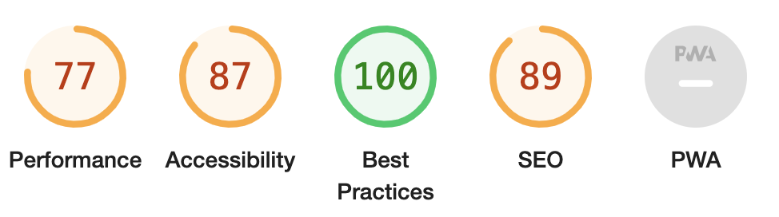

#### Checkout Mobile
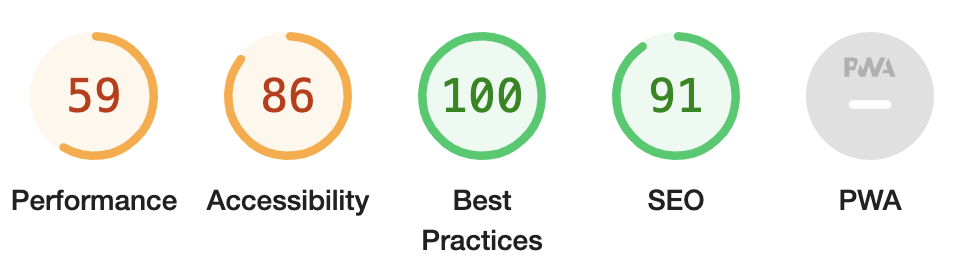

#### Checkout Success Desktop
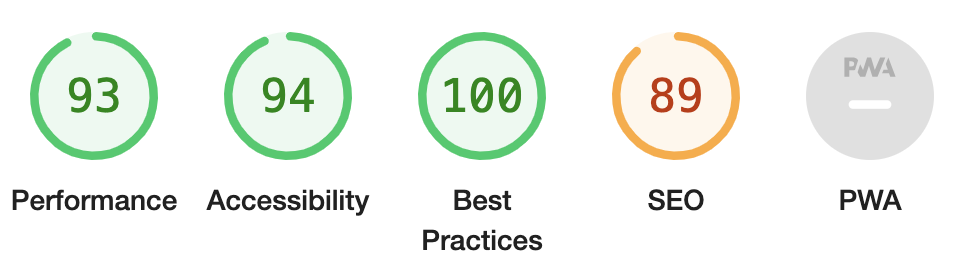

#### Checkout Success Mobile
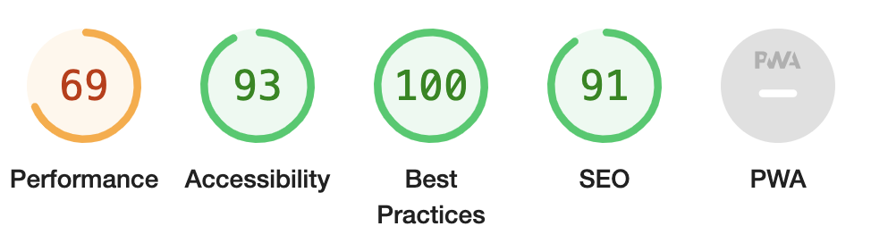

#### Home Desktop
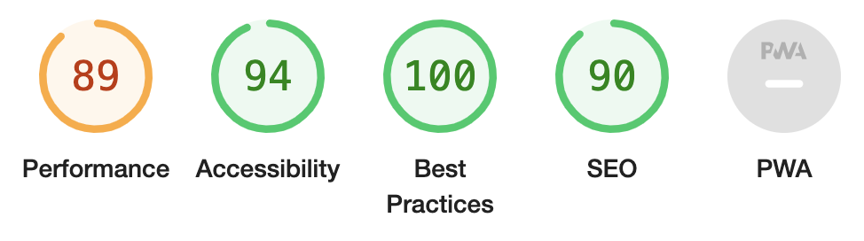

#### Home Mobile
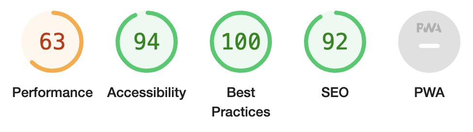

#### Product Detail Desktop

#### Product Detail Mobile
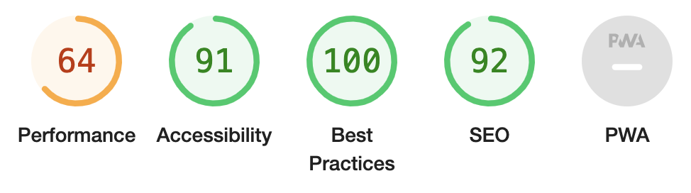

#### Products Desktop
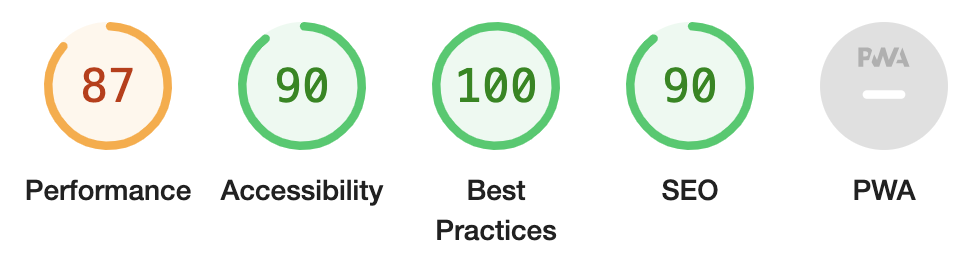

#### Products Mobile

#### Profile Desktop
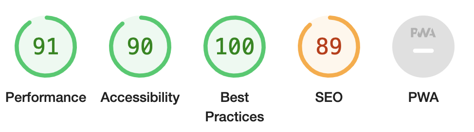

#### Profile Mobile
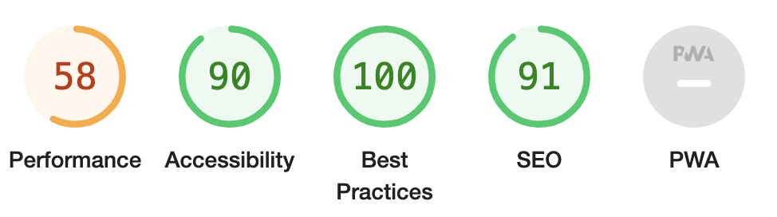

#### Register Desktop
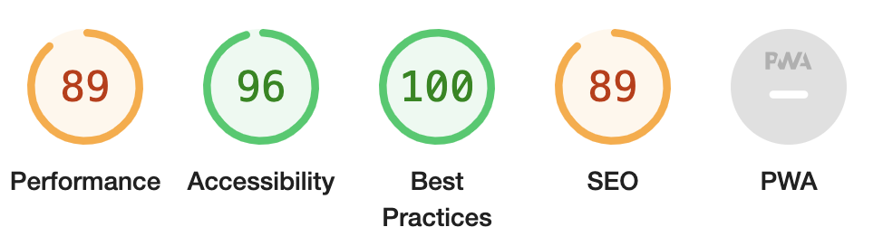

#### Register Mobile
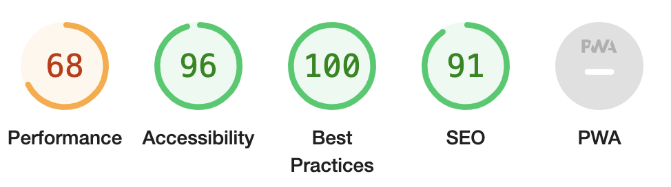

#### Sign In Desktop
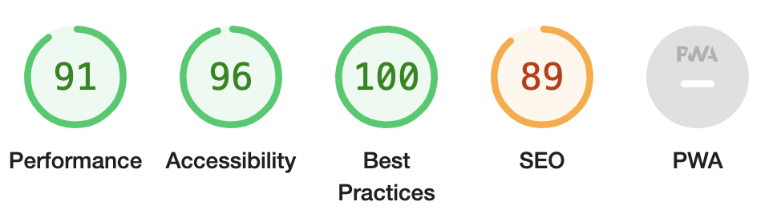

#### Sign In Mobile
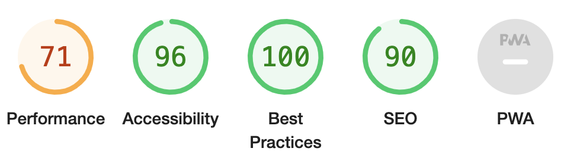

## Manual Testing

